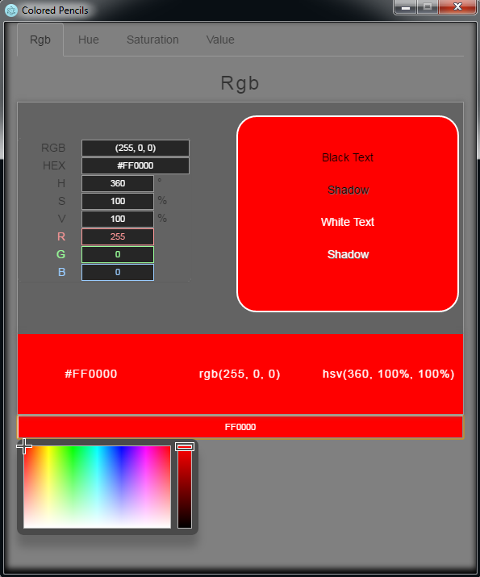
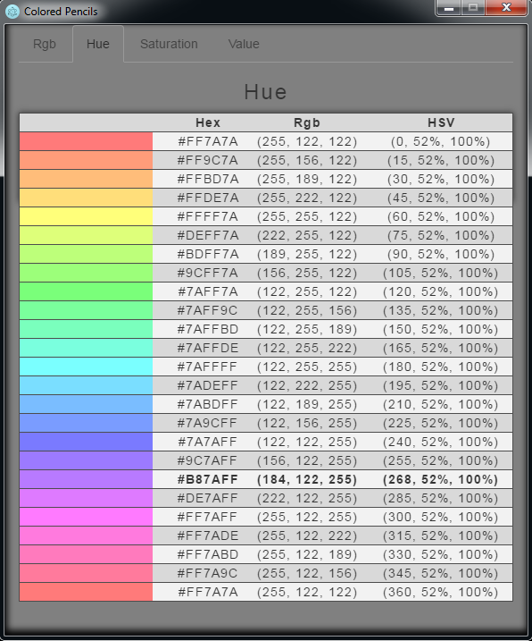
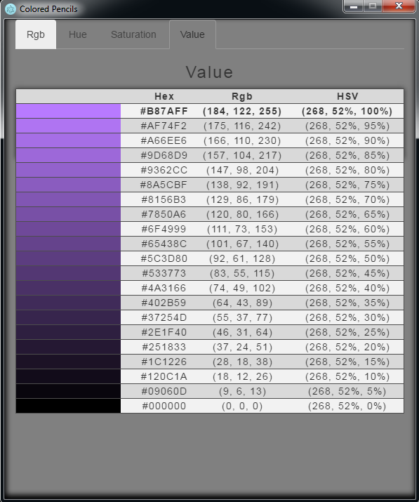

# colored-pencils
> Interactive color palette for quick color picking

## Features

* On the rgb tab if you click the boxes at the bottom with the color values then it will copy that value into your clipboard.

* On the Hue, Saturation, and Value tabs you can click the colors and all the values on the rgb tab will update.

## Screenshots

 

## License

MIT © [Alex Brelsford](abrelsfo.github.io)
