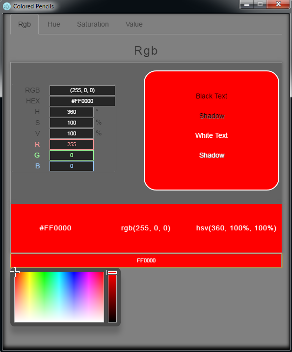
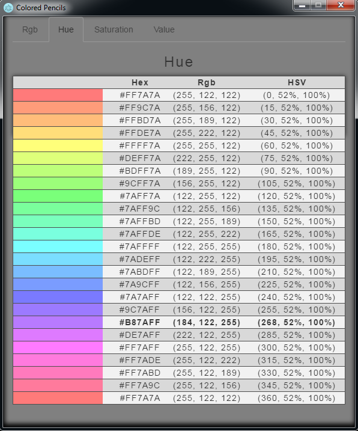
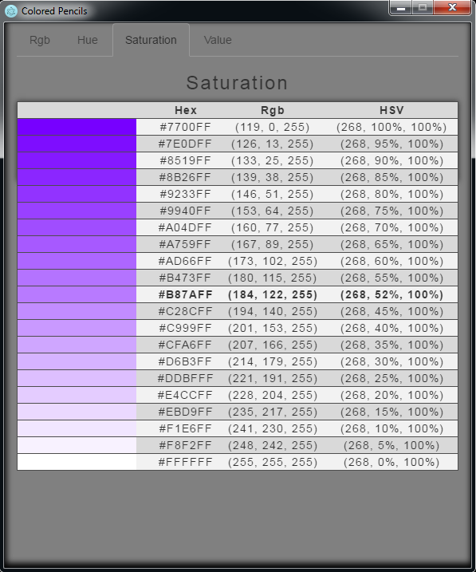
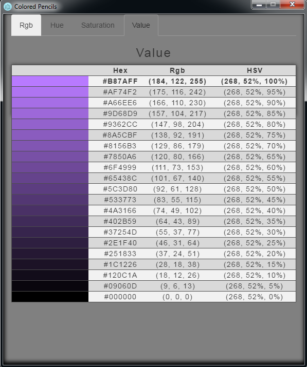

# colored-pencils
> Interactive color palette for quick color picking

I created this because I wanted a color palette that combined all my favorite features from w3schools color picker and thomaslindstroms color-picker Atom module. I used jscolor for the mini color picker and to change the text color.

## Features

* On the rgb tab if you click the boxes at the bottom with the color values then it will copy that value into your clipboard.

* On the Hue, Saturation, and Value tabs you can click the colors and all the values on the rgb tab will update.

## Downloads

Go to [Releases](https://github.com/abrelsfo/colored-pencils/releases), then you can download prebuilt binaries

## Screenshots

 

## License

MIT © [Alex Brelsford](abrelsfo.github.io)
